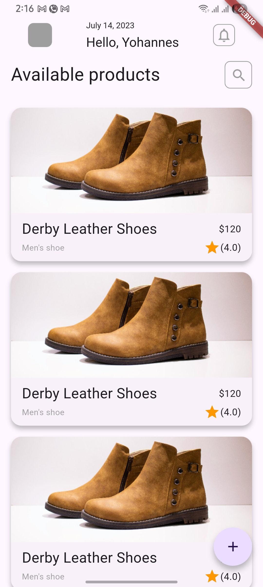
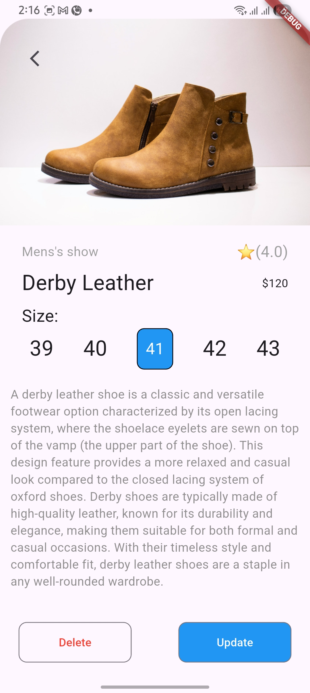
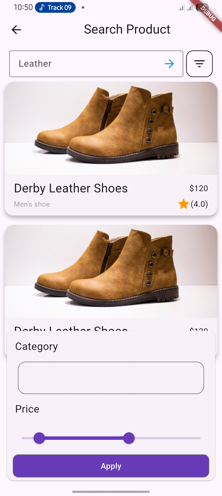

## Submission — Task 6

This README documents the submission for Task 6. The screenshots below illustrate the app UI and key features implemented for this task.

### Features implemented
- Basic Flutter app structure used for Task 6.
- UI screens and interactions shown in screenshots.
- Assets and layout validated on device/emulator.

### Screenshots
<table>
    <tr>
        <td align="center">
             
            Home
        </td>
        <td align="center">
             
            Detail
        </td>
        <td align="center">
             
            Add Product
        </td>
        <td align="center">
             
            Search
        </td>
    </tr>
</table>

## Submission — Task 7

Task 7 implements app routing using named routes and demonstrates passing data from the Add page back to the Home page.

### Features implemented
- Configured named routes in MaterialApp.
- Using named routes to pass data from the add page to the home page.

### Video
<video controls width="360" height="640" style="max-width:100%; aspect-ratio:9/16;">
    <source src="wiki/task_7/task_7.mp4" type="video/mp4">
    Your browser does not support the video tag. Download/open the video directly:
    <a href="https://github.com/Jeyididya/project-phase-mobile-tasks/raw/main/task_6/wiki/task_7/task_7.mp4">task_7.mp4</a>
</video>

Use this [link](https://github.com/Jeyididya/project-phase-mobile-tasks/blob/main/task_6/wiki/task_7/task_7.mp4) if playback fails.

If screenshots/videos are not visible, ensure the `wiki/` folder exists at the repository root and contains the referenced files.
