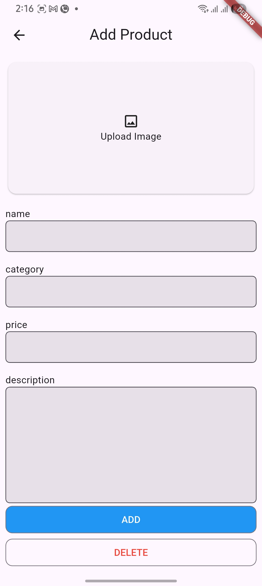

## Submission — Task 6

This README documents the submission for Task 6. The screenshots below illustrate the app UI and key features implemented for this task.

### Features implemented
- Basic Flutter app structure used for Task 6.
- UI screens and interactions shown in screenshots.
- Assets and layout validated on device/emulator.

### Screenshots
<table>
    <tr>
        <td align="center">
             
            Home
        </td>
        <td align="center">
             
            Detail
        </td>
        <td align="center">
             
            Add Product
        </td>
        <td align="center">
             
            Search
        </td>
    </tr>
</table>

If screenshots are not visible, ensure the `screenshots/` folder exists at the repository root and contains the referenced PNG files.