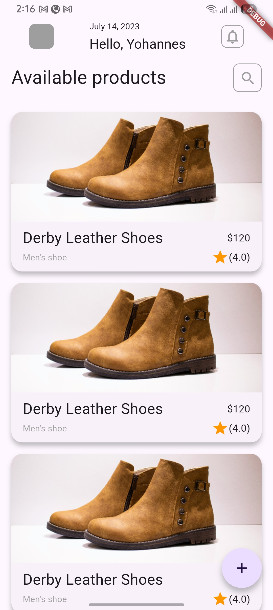
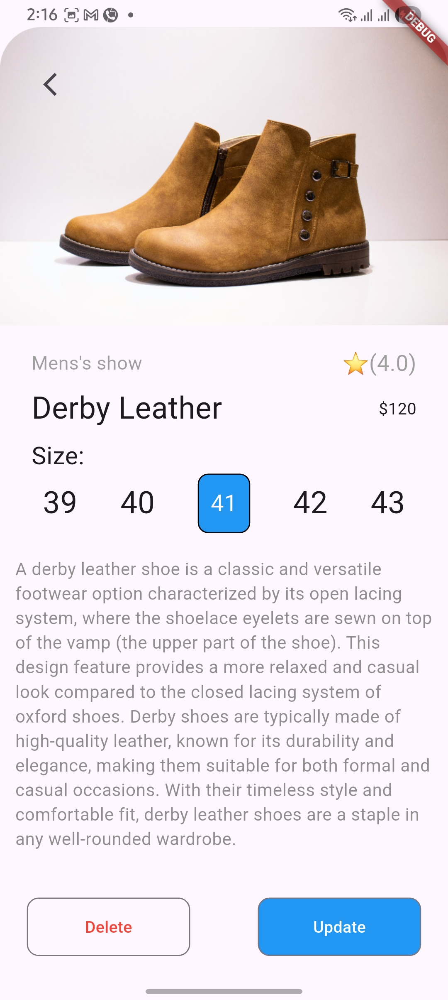
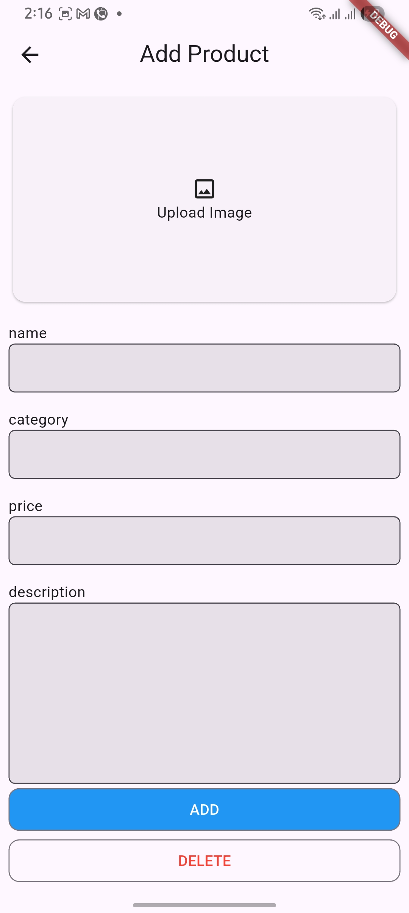
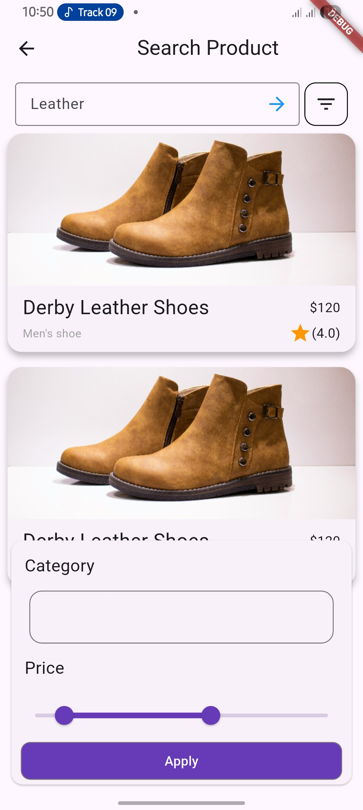

## Submission — Task 6

This README documents the submission for Task 6. The screenshots below illustrate the app UI and key features implemented for this task.

### Features implemented
- Basic Flutter app structure used for Task 6.
- UI screens and interactions shown in screenshots.
- Assets and layout validated on device/emulator.

### Screenshots
<table>
    <tr>
        <td align="center">
             
            Home
        </td>
        <td align="center">
             
            Detail
        </td>
        <td align="center">
             
            Add Product
        </td>
        <td align="center">
             
            Search
        </td>
    </tr>
</table>

## Submission — Task 7

Task 7 implements app routing using named routes and demonstrates passing data from the Add page back to the Home page.

### Features implemented
- Configured named routes in MaterialApp.
- Using named routes to pass data from the add page to the home page.

### Video
    
<video controls width="360" height="640" style="max-width:100%; aspect-ratio:9/16;">
    <source src="wiki/task_7/task_7.mp4" type="video/mp4">
    Your browser does not support the video tag. Download/open the video directly:
    <a href="https://github.com/Jeyididya/project-phase-mobile-tasks/raw/main/task_6/wiki/task_7/task_7.mp4">task_7.mp4</a>
    Your browser does not support the video tag. Download/open the video directly:
    <a href="https://github.com/Jeyididya/project-phase-mobile-tasks/raw/main/task_6/wiki/task_7/task_7.mp4">task_7.mp4</a>
</video>

Use this [link](https://github.com/Jeyididya/project-phase-mobile-tasks/blob/main/task_6/wiki/task_7/task_7.mp4) if playback fails.
Use this [link](https://github.com/Jeyididya/project-phase-mobile-tasks/blob/main/task_6/wiki/task_7/task_7.mp4) if playback fails.

If screenshots/videos are not visible, ensure the `wiki/` folder exists at the repository root and contains the referenced files.

## Submission — Task 8

- Prepared tests for:
    - Test Product Listing — [test/product_list_test.dart](test/product_list_test.dart) 
    - Test Product Creation [test/product_creation_test.dart](test/product_creation_test.dart) 
    - Test Product Detail Page Navigation [test/detail_page_navigation_test.dart](test/detail_page_navigation_test.dart) 

## Submission - Task 10

# Clean Architecture — Data Overview Layer

### Project Structure
This project uses Clean Architecture:

lib/
|-- core/ # Shared utilities
|-- features/
| --- products/
| --- domain/ # Entities & usecases
| --- data/ # Models & repositories
| --- presentation/ # UI (screens)
|---main.dart 

###  Data Flow

#### Domain → Pure business rules  
- Product Entity  
- Repository interface  
- Usecases  

#### Data  Implementation  
- ProductModel (JSON)
- Repository implementation

#### Presentation  UI  
- Widgets, screens, state management

# Task 11 - Contracts of Data Sources

## Data Flow

### Domain Layer → Pure Business Rules
- Product Entity: Immutable business object
- Repository Interface: Abstract contract defining data operations
- Use Cases: Single-purpose business logic classes

### Data Layer → Implementation Details
- ProductModel: Extends Product entity, adds JSON serialization
- Data Source Contracts: Abstract interfaces for remote/local operations
- Repository Implementation: Uses contracts, switches based on connectivity
- NetworkInfo: Abstracts network status checking

### Presentation Layer → UI

- Dependency Injection: Services provided via GetIt

## Key Contracts Added
1. ProductRemoteDataSource: Defines remote API operations
2. ProductLocalDataSource: Defines local storage operations
3. NetworkInfo: Abstracts connectivity status

## Submission — Task 12

This section documents Task 12: Implement Repository.

### What I implemented
   - Checks network status with NetworkInfo.
    - Uses ProductRemoteDataSource when online.
    - Uses ProductLocalDataSource when offline.
    - Caches remote results locally after successful remote fetches.

## Submission — Task 13

This section documents Task 13: Implement NetworkInfo.

### What I implemented
- Implemented NetworkInfo and NetworkInfoImpl in lib/core/network/network_info.dart.
    - NetworkInfoImpl is backed by InternetConnectionChecker and exposes the isConnected getter.
    - The concrete implementation accepts an InternetConnectionChecker instance via constructor injection.

## Submission — Task 14

This section documents Task 14: Implement Local Data Source.

### What I implemented
- Implemented ProductLocalDataSourceImpl in lib/features/products/data/datasourses/product_local_data_source_impl.dart.
  - Persists products to =SharedPreferences as a JSON list under the key products.
  - Loads cached products from SharedPreferences when needed.
  - Implements insert, update, delete, read (single and all) and cache operations.
  - Keeps an in-memory map for fast access and writes back to prefs on changes.

## Submission — Task 17

This section documents Task 17: Implement Bloc for Product Management.

### What I implemented
- Created event classes in lib/features/products/presentation/bloc/product_event.dart:
    - LoadAllProductsEvent, GetSingleProductEvent, UpdateProductEvent, DeleteProductEvent, CreateProductEvent.
- Created state classes in lib/features/products/presentation/bloc/product_state.dart:
    - InitialState, LoadingState, LoadedAllProductsState, LoadedSingleProductState, ErrorState.
- Implemented ProductBloc in lib/features/products/presentation/bloc/product_bloc.dart:
    - Handles all events, emits correct states, interacts with use cases, and handles errors.
    - Uses the bloc package for stream-based state management.

### Tests added
- test/features/products/presentation/bloc/product_bloc_test.dart:

